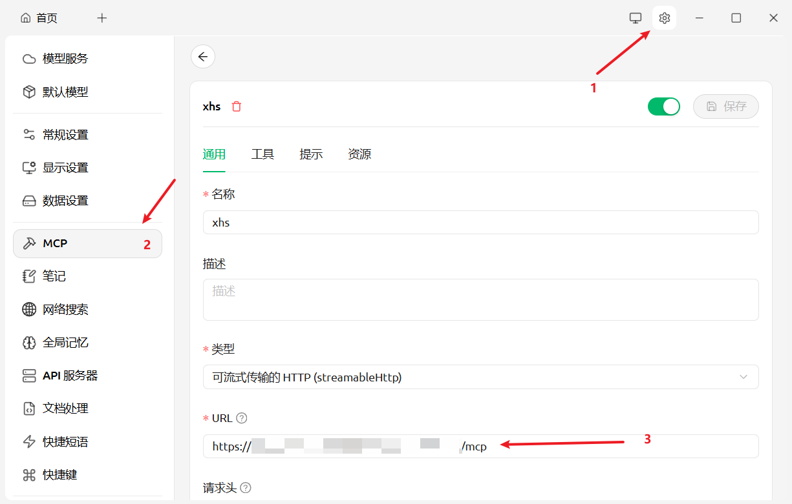
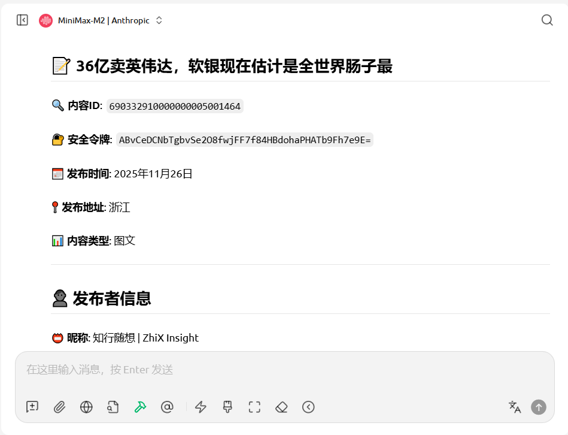

# xiaohongshu-mcp-py

> Python rewrite of the Xiaohongshu automation toolchain powered by Playwright + FastMCP. 可直接作为 MCP 服务暴露给 cc或者cherry studio 等客户端。

## Table of Contents

1. [Overview / 项目简介](#overview--项目简介)
2. [Repository Layout / 目录速览](#repository-layout--目录速览)
3. [Requirements & Installation / 环境依赖](#requirements--installation--环境依赖)
4. [Login & Session Management / 登录与会话管理](#login--session-management--登录与会话管理)
5. [Running the MCP Server / 启动-mcp-服务](#running-the-mcp-server--启动-mcp-服务)
6. [Available MCP Tools / 可用工具一览](#available-mcp-tools--可用工具一览)
7. [Manual CLIs & Utilities / 手动调试工具](#manual-clis--utilities--手动调试工具)
8. [Debugging & Troubleshooting / 调试与排障](#debugging--troubleshooting--调试与排障)
9. [Development Notes / 开发者提示](#development-notes--开发者提示)

---

## Overview / 项目简介

- 通过 Playwright 驱动 Chromium（默认 headless），在 `xhs_mcp/xhs` 中把「首页、搜索、详情、发布、互动、登录、个人主页」等操作抽象成独立动作。
- `xhs_mcp/mcp_server.py` 把这些动作暴露为标准 MCP Tool，既可通过 `streamable-http` 远程调用，也可通过 `stdio` 作为本地子进程集成。
- `xhs_mcp/cli/login_cli.py` 和 `scripts/manual_actions.py` ：前者专注于扫码登录与 cookies 落地，后者用于对浏览器动作的测试。
- Cookies / storage_state 采用 profile + `profiles/<name>/cookies.json` 的模式保存，同时兼容旧的 `/tmp/cookies.json` 与 `COOKIES_PATH` 环境变量，避免破坏历史部署。
- 内置 `scripts/clean_array.py` 对抓取到的 feed 数据做简单脱敏（去除 `noteCard.user.xsecToken`），利于下游安全存储与对外暴露。

## Repository Layout / 目录速览

| Path | Purpose |
| --- | --- |
| `xhs_mcp/xhs/` | Playwright action layer：feeds、搜索、详情、发布、互动、登录、个人主页等动作的实现。 |
| `xhs_mcp/infra/` | 浏览器基础设施：Playwright 启动参数（轻量 stealth）、context 管理、cookies 读写。 |
| `xhs_mcp/mcp_server.py` | MCP 服务定义及所有 tool 的适配层，同时处理 debug/trace、参数默认值等。 |
| `xhs_mcp/cli/` | CLI 入口：`mcp_cli` 负责运行 MCP 服务，`login_cli` 负责扫码登录。 |
| `scripts/manual_actions.py` | 方便开发者在命令行直接触发 feeds/search/publish 等动作，输出 JSON 结果。 |
| `scripts/clean_array.py` | 针对 feed 数据的脱敏清洗工具，可独立运行或作为模块导入。 |
| `profiles/` | Profile 级别的 cookies 存储目录，示例 `profiles/myacc/cookies.json`。 |

## Requirements & Installation / 环境依赖

```bash
python -m venv .venv && source .venv/bin/activate  # 推荐使用虚拟环境
pip install -r requirements.txt
playwright install chromium  # 首次运行需要安装浏览器
```

Minimum runtime: Python 3.11+、Playwright ≥ 1.44、Typer ≥ 0.12、FastMCP (mcp ≥ 0.1)。  
部署在服务器上时，可通过 `CHROME_BIN` 指定自定义 Chromium/Chrome，可更好地规避风控。

## Login & Session Management / 登录与会话管理

1. **Cookies 存储策略**（见 `xhs_mcp/configs.py`）：
   - 优先复用历史 `/tmp/cookies.json`。
   - 其次读取 `COOKIES_PATH` 环境变量。
   - 若提供 `--profile`，会自动使用/创建 `profiles/<profile>/cookies.json`。
   - 也可以显式传入 `--cookies-path`。
2. **扫码登录流程**（`python -m xhs_mcp.cli.login_cli`）：
   - `check`：确认当前 cookies 是否已登录。
   - `get_qrcode`：抓取二维码图片（data URL 或远程 URL），写入 `login.png`。
   - `wait`：阻塞等待扫码完成并保存最新 cookies。
   - `login`：一条命令串联 “获取二维码 → 等待登录 → 保存 cookies”，适合部署脚本。
3. 若使用多账号，请为每个账号配置独立 profile 目录，避免 storage_state 相互覆盖。

## Running the MCP Server / 启动 MCP 服务

```bash
python -m xhs_mcp.cli.mcp_cli serve \
  --host 0.0.0.0 \
  --port 8000 \
  --transport streamable-http \
  --profile myacc \
  --debug-dir debug \
  --trace
```


- `--debug-dir` 会在每次调用后落地 DOM、截图、console log；配合 `--trace` 可生成 Playwright trace。
- LangGraph / Claude Desktop 接入：在 `MultiServerMCPClient` 或配置文件中添加 `streamable_http` endpoint，指向 `http://<host>:<port>/mcp`。

## Available MCP Tools / 可用工具一览

| Tool | Purpose | Required params | Notes |
| --- | --- | --- | --- |
| `feeds_list` | 获取首页推荐 feed 列表 | (登录态) | 返回值会通过 `clean_array.clean_xsec_tokens` 脱敏。 |
| `search_feeds` | 搜索 feed | `keyword` | 同样会去除内嵌用户 `xsecToken`。 |
| `feed_detail` | 获取笔记详情 + 评论 | `feed_id`, `xsec_token` | 直接读取 `__INITIAL_STATE__`。 |
| `publish_image` | 发布图文笔记 | `title`, `content`, `image_paths` | `image_paths` 为本地文件列表，可附带 `tags`。 |
| `publish_video` | 发布视频笔记 | `title`, `content`, `video_path` | 自动等待上传完成再点击发布。 |
| `post_comment` | 评论笔记 | `feed_id`, `xsec_token`, `content` | 通过页面定位编辑框后提交。 |
| `like_feed` / `unlike_feed` | 点赞/取消点赞 | `feed_id`, `xsec_token` | 读取互动状态后避免重复点击。 |
| `favorite_feed` / `unfavorite_feed` | 收藏/取消收藏 | `feed_id`, `xsec_token` | 同步状态判断逻辑与点赞类似。 |
| `user_profile` | 查看任意用户主页 | `user_id`, `xsec_token` | 返回 basic info + interactions + feeds。 |
| `my_profile` | 查看当前登录账号主页 | (登录态) | 通过侧边栏导航进入个人页。 |
| `check_login` | 判断当前 cookies 是否有效 | – | 适合探活。 |


所有工具均接受 `profile` / `cookies_path` / `chrome_bin` / `debug_dir` / `trace` 参数，CLI 层也可以通过 `configure_defaults` 设定全局默认值。


## Run Flow / 项目运行流程

> 登录应该在 MCP 进程启动之前完成；MCP 服务只消费既有 cookies。

1. **准备依赖（首次执行）**

   ```bash
   python -m venv .venv && source .venv/bin/activate
   pip install -r requirements.txt
   playwright install chromium
   ```

2. **扫码登录（生成 cookies 文件）**

   ```bash
   python -m xhs_mcp.cli.login_cli login \
     --profile myacc \
     --out login.png \
     --timeout 240
   ```

   - CLI 会无头抓取二维码并写入 `login.png`，请用手机扫描完成登录。
   - 登录成功后，cookies 会保存到 `profiles/myacc/cookies.json`（或你指定的 `--cookies-path`）。
   - 随时验证会话是否仍有效：

     ```bash
     python -m xhs_mcp.cli.login_cli check --profile myacc
     ```

3. **启动 MCP 服务**

   ```bash
   python -m xhs_mcp.cli.mcp_cli serve \
     --host 0.0.0.0 \
     --port 8000 \
     --profile myacc \
     --debug-dir debug
   ```

   - 服务会复用步骤 2 生成的 cookies，`debug/` 下会保留 DOM、截图、console 日志。
   - 若需要与本地应用直连（Claude Desktop 等），请将 `--transport` 改为 `stdio`。

4. **连接客户端 / 验证**

   可以使用cherry stio：
   
   
   


## Debugging & Troubleshooting / 调试与排障

- 若页面元素无法点击，可使用 `PublishImageAction` / `_PublishBase` 中的 `_select_tab` 逻辑作为参考（包括弹窗移除与 focus 修复）。
- `profiles/<name>/cookies.json` 建议纳入 `.gitignore`（默认已忽略），避免泄漏。
- 通过环境变量 `PLAYWRIGHT_BROWSERS_PATH` 可复用系统级浏览器安装，减少镜像体积。
- `debug/` 目录下的截图可对照时间戳定位具体请求。
- 遇到 `no feeds found in __INITIAL_STATE__` 等错误，多半是 cookies 过期或页面结构改变，优先使用 `login_cli` 重新登录并复现。

## Development Notes / 开发者提示

- 代码使用 Python 3.11 的 `typing` 新语法（`list[str]` 等），请确保本地解释器版本满足要求。
- 行为层（`xhs_mcp/xhs/*.py`）与服务层（`xhs_mcp/mcp_server.py`）已经解耦，扩展新动作时建议先在 `scripts/manual_actions.py` 中验证，再注册为 MCP tool。
- 建议在合并前运行 `playwright codegen` / `trace.viewer` 自查元素定位，减少线上改动频率。
- 欢迎提交 Issue/PR，一起把小红书 MCP 能力覆盖到更多工作流。

---

Happy automating! ✨
